<p align="center">
  
  <br />
  <strong>星云编年史 · Nebula Chronicle</strong>
  <br />
  <em>指尖划过六十载动漫银河 · 声音唤醒经典回忆 · AI 陪你重回热血年代</em>
  <br /><br />
  <a href="https://mw2wbyys6t-sudo.github.io/nebula-chronicle/">
    
  </a>
  &nbsp;
  
  &nbsp;
  
  &nbsp;
  
  &nbsp;
  
</p>

---

## 项目简介

《星云编年史》以 1963 年至今的经典日本动画为数据基础，将时间轴化作可探索的星云次元。用户可以通过语音或手势与系统交互，让 LLM 助手查找、播放作品，也能在闲暇时切换到闲聊模式进行日常对话。

本项目基于 **Vue 3 + Vite** 构建，纯前端实现，无需后端即可运行；LLM 与 TTS 能力直接调用浏览器及第三方 API。

**在线体验**：[https://mw2wbyys6t-sudo.github.io/nebula-chronicle/](https://mw2wbyys6t-sudo.github.io/nebula-chronicle/)

---

## 效果展示

### 星云宣传影片

三大星云主题宣传片，由 AI 视频生成模型（Seedance 2.0）制作，展示八位萌王角色在星云宇宙中的群像：

<table>
  <tr>
    <td align="center"><b>星云环影 · Trailer A</b></td>
    <td align="center"><b>群像蒙太奇 · Trailer B</b></td>
    <td align="center"><b>玻璃卡仪式 · Trailer C</b></td>
  </tr>
  <tr>
    <td>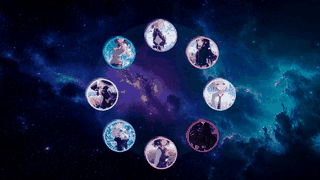</td>
    <td>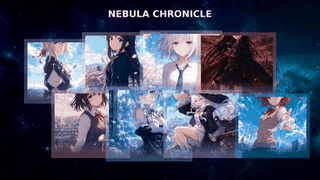</td>
    <td>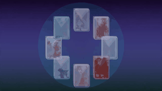</td>
  </tr>
</table>

### 背景动画素材

用于入口页和宇宙阶段的循环背景动画，涵盖星云、魔法大厅与樱花飘落三种主题：

<table>
  <tr>
    <td align="center"><b>星空宇宙</b></td>
    <td align="center"><b>魔法大厅</b></td>
    <td align="center"><b>星云樱花</b></td>
  </tr>
  <tr>
    <td>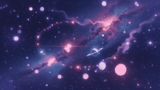</td>
    <td>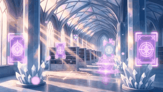</td>
    <td></td>
  </tr>
</table>

### 角色海报

8 位 ISML（国际最萌大会）冠军女主角登录页海报，轮播切换时角色信息、主题色、玻璃卡片光效实时联动：

<table>
  <tr>
    <td align="center"></td>
    <td align="center"></td>
    <td align="center"></td>
    <td align="center">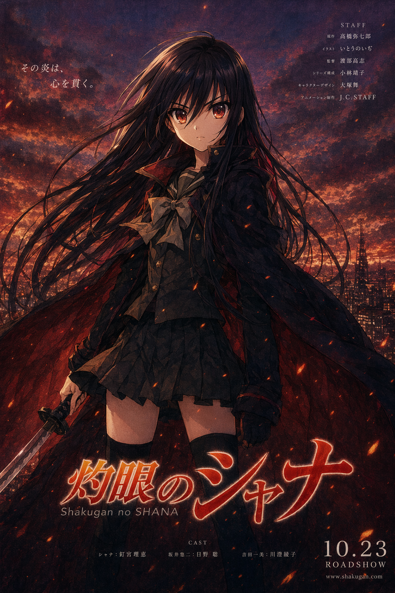</td>
  </tr>
  <tr>
    <td align="center"><b>薇尔莉特 · 伊芙加登</b><br/><sub>紫罗兰永恒花园</sub></td>
    <td align="center"><b>秋山 澪</b><br/><sub>K-ON!</sub></td>
    <td align="center"><b>立华 奏</b><br/><sub>Angel Beats!</sub></td>
    <td align="center"><b>夏娜</b><br/><sub>灼眼的夏娜</sub></td>
  </tr>
  <tr>
    <td align="center"></td>
    <td align="center"></td>
    <td align="center">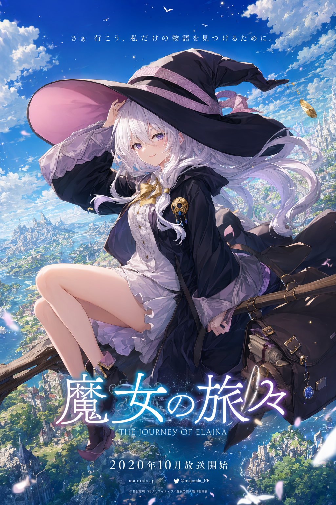</td>
    <td align="center">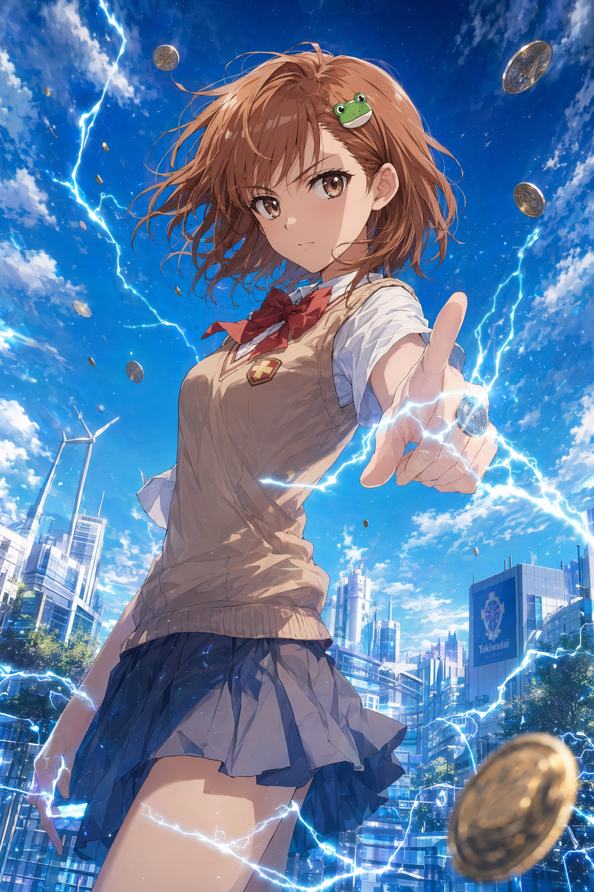</td>
  </tr>
  <tr>
    <td align="center"><b>加藤 惠</b><br/><sub>路人女主的养成方法</sub></td>
    <td align="center"><b>雷姆</b><br/><sub>Re:从零开始的异世界生活</sub></td>
    <td align="center"><b>伊蕾娜</b><br/><sub>魔女之旅</sub></td>
    <td align="center"><b>御坂 美琴</b><br/><sub>某科学的超电磁炮</sub></td>
  </tr>
</table>

### AI 生成视觉素材

入口页和宇宙阶段使用的 AI 生成背景图、玻璃光盘、魔法阵等视觉元素：

<table>
  <tr>
    <td align="center"><b>星云背景</b></td>
    <td align="center"><b>玻璃光盘</b></td>
    <td align="center"><b>魔法阵</b></td>
    <td align="center"><b>樱花大厅</b></td>
  </tr>
  <tr>
    <td align="center">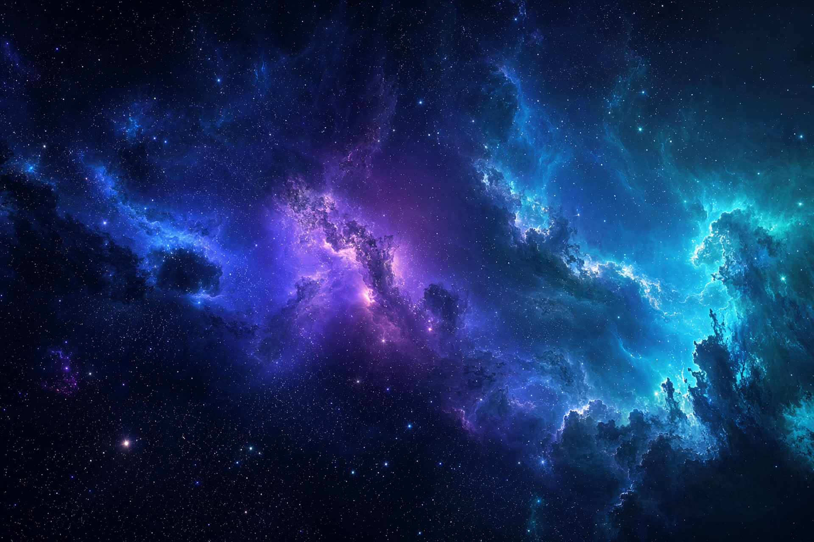</td>
    <td align="center">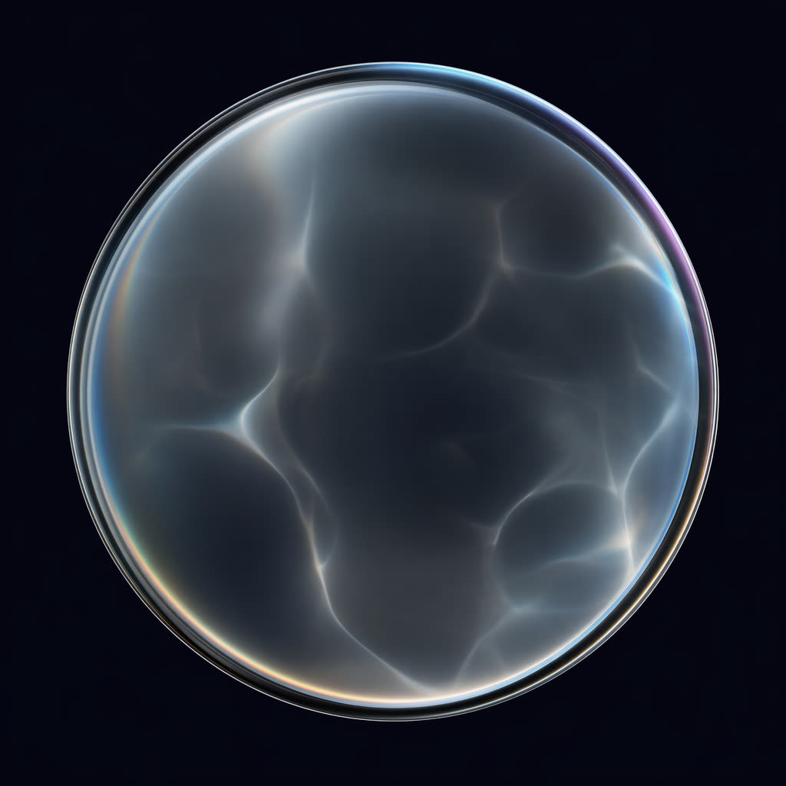</td>
    <td align="center">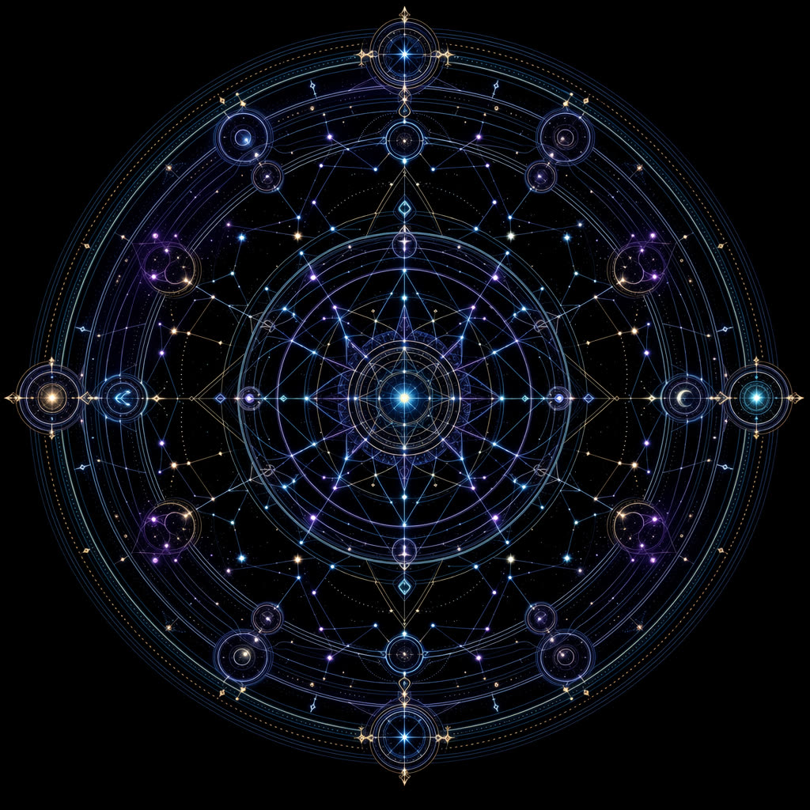</td>
    <td align="center">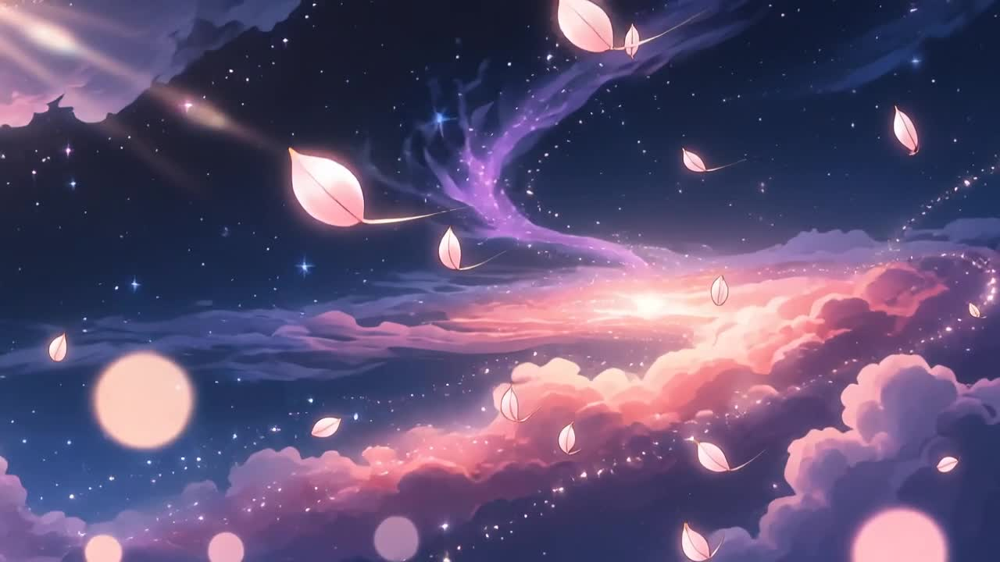</td>
  </tr>
</table>

---

## 核心功能

### 1. 沉浸式入口页（双模式）

统一入口 `/index.html` 融合了沉浸启动动画与轻量登录页：

| 模式 | 说明 |
|------|------|
| **沉浸模式** | Three.js 3D 星云世界启动动画，GSAP 时间线编排。星云苏醒 → 玻璃凝聚 → 角色觉醒 → 编年史展开 → 星图散开成粒子 → 星云漩涡 → 标题水印 + 登录界面升起 → 角色凝聚为守护星座环 |
| **轻量模式** | 8 位 ISML 冠军女主角海报轮播 + 左侧角色信息卡片 + 右侧 Liquid Glass 登录卡片。轮播切换时角色信息、主题色、玻璃卡片光效实时联动。Canvas 粒子背景与鼠标跟随玻璃高光 |

- 双模式一键切换（右上角按钮）
- 智能降级：移动端、WebGL 不支持或偏好减少动画时自动进入轻量模式
- 交互反馈：输入框主题色循环发光、按钮流光扫过/涟漪、登录成功星尘爆发、空格跳过动画
- 程序化环境背景音乐（需用户手动开启）

### 2. 动漫编年史可视化

- 基于 Three.js 的星云背景与螺旋时间轴
- 按年份、类型、作品展示经典动画卡片（1963–至今，40+ 部作品）
- 点击作品可查看详情，并跳转播放页

### 3. 知识图谱引擎

- 基于 `knowledge-graph.json`（6.1MB）的动漫关系图谱
- 支持关系查询、路径发现、智能推荐
- LRU 缓存优化，KnowledgeEngine 引擎驱动

### 4. LLM 多轮语音助手

- **命令模式**：通过语音/文字指令查找作品、控制播放、询问信息
- **闲聊模式**：切换后进入日常对话，支持多轮上下文记忆（默认保留最近 10 轮）
- 语音合成（Web Speech API）自动朗读助手回复
- 支持 `.env` 配置自有 API Key

### 5. 手势与语音控制

- 集成 MediaPipe Hands，支持摄像头手势识别
- 语音指令可控制播放、暂停、上一部、下一部等操作
- 播放页支持 Bilibili BV 号或本地视频源

### 6. 全局错误边界与 UI 音效

- 任何子组件渲染错误均不会白屏，显示"星辰信号中断"降级 UI
- Web Audio API 合成 UI 音效：select / hover / swipe / back / phaseChange / error 等
- 支持 `prefers-reduced-motion` 减少动画偏好
- 移动端触摸优化（防双击缩放、44px 最小触控区域）

### 7. 角色展示短片

- 8 位萌王角色 Ken Burns 展示短片 + 星云主题视频素材
- 可直接作为项目宣传或 BGM 背景素材

---

## 架构概览

### 阶段流转

应用采用 **四阶段流转** 设计，通过 `App.vue` 中的 `<Transition>` 组件管理切换：

```
Loading → Showcase → Landing → Universe
   │          │         │          │
   │          │         │          └─ Three.js 星云宇宙（异步加载）
   │          │         └─ Liquid Glass 登录页
   │          └─ 角色海报轮播
   └─ 初始化与资源预加载
```

### 引擎架构

```
                    ┌─────────────┐
                    │  EventBus   │ ◄── 全局事件总线
                    └──────┬──────┘
                           │
        ┌──────────────────┼──────────────────┐
        │                  │                  │
   ┌────▼─────┐     ┌─────▼─────┐     ┌──────▼──────┐
   │   AI      │     │  Data     │     │  Universe   │
   │  Engine   │     │  Engine   │     │   Engine    │
   ├───────────┤     ├───────────┤     ├─────────────┤
   │ Intent    │     │ Anime     │     │ Galaxy      │
   │ Parser    │     │ Data      │     │ Spiral      │
   │ Narrator  │     │ Knowledge │     │ Timeline    │
   └───────────┘     │ Graph     │     └─────────────┘
                     └───────────┘
        │                  │                  │
        └──────────────────┼──────────────────┘
                           │
                    ┌──────▼──────┐
                    │ Interaction │
                    │   Engine    │
                    ├─────────────┤
                    │ Gesture     │
                    │ Voice       │
                    └─────────────┘
```

---

## 项目结构

```
nebula-chronicle/
├── src/                              # Vue 3 源码
│   ├── components/                   # 8 个 Vue 组件
│   │   ├── LoadingPhase.vue          # 加载阶段
│   │   ├── ShowcasePhase.vue         # 展示阶段（角色轮播）
│   │   ├── LandingPhase.vue          # 登录阶段
│   │   ├── EntrancePhase.vue         # 入口过渡
│   │   ├── UniversePhase.vue         # 星云宇宙阶段（异步加载）
│   │   ├── HUD.vue                   # 平视显示器
│   │   ├── NodePanel.vue             # 节点面板
│   │   └── OrbitTimeline.vue         # 轨道时间轴
│   ├── composables/                  # 6 个可组合函数
│   │   ├── useAudio.js               # 音频控制
│   │   ├── useData.js                # 数据管理
│   │   ├── useVoice.js               # 语音交互
│   │   ├── useUiSound.js             # UI 音效合成
│   │   ├── useProgressiveImage.js    # 渐进式图片懒加载
│   │   └── useVideoBackground.js     # 视频背景
│   ├── engines/                      # 引擎模块
│   │   ├── ai/                       # AI 引擎（3 个文件）
│   │   ├── core/                     # 核心引擎（2 个文件）
│   │   ├── data/                     # 数据引擎（2 个文件）
│   │   ├── interaction/              # 交互引擎（5 个文件）
│   │   ├── universe/                 # 宇宙引擎（3 个文件）
│   │   └── feedback/                 # 反馈引擎（2 个文件）
│   ├── styles/
│   │   └── universe.css              # 宇宙主题样式
│   ├── App.vue                       # 根组件（含错误边界）
│   └── main.js                       # 应用入口
├── public/                           # 静态资源
│   ├── data/                         # 4 个数据文件（详见下方数据说明）
│   ├── images/                       # 图片资源
│   │   ├── {0-41}.jpg                # 动漫作品封面（42 张）
│   │   ├── login/                    # 8 位角色登录海报
│   │   ├── effects/                  # 特效贴图（5 张）
│   │   └── generated/                # AI 生成素材（视频 + 海报）
│   ├── fonts/                        # NotoSansCJK 字体
│   ├── js/                           # 4 个公共 JS 文件
│   ├── watch.html                    # 视频播放页
│   └── favicon.svg                   # 网站图标
├── scripts/                          # 工具脚本（12 个）
├── docs/                             # 设计文档 + GIF 素材
│   ├── gifs/                         # README 展示用 GIF 动图
│   └── *.md                          # 9 篇设计文档
├── index.html                        # 主入口页
├── package.json                      # 依赖与脚本配置
├── vite.config.js                    # Vite 构建配置
├── .env.example                      # 环境变量模板
└── .github/workflows/pages.yml       # GitHub Pages CI/CD
```

---

## 快速开始

### 环境要求

- Node.js >= 18
- npm >= 9

### 开发模式

```bash
git clone https://github.com/mw2wbyys6t-sudo/nebula-chronicle.git
cd nebula-chronicle
npm install
npm run dev
```

打开浏览器访问 `http://localhost:8080/`

### 生产构建

```bash
npm run build
```

构建产物输出到 `dist/` 目录，可直接部署到任何静态托管服务。

### 预览构建产物

```bash
npm run preview
```

### 配置 LLM API Key

1. 复制配置模板：
   ```bash
   cp .env.example .env
   ```
2. 编辑 `.env`，填入你的 API Key 与模型地址：
   ```
   VITE_LLM_API_KEY=your_api_key_here
   VITE_LLM_BASE_URL=https://your-api-endpoint.com/v1
   VITE_LLM_MODEL=your_model_name
   VITE_LLM_TEMPERATURE=0.3
   VITE_LLM_MAX_TOKENS=512
   ```
3. `.env` 已加入 `.gitignore`，Key 不会被提交到仓库。

---

## 部署

### GitHub Pages（推荐）

项目已配置 GitHub Actions 自动部署：

1. Fork 或克隆本仓库
2. 推送代码到 `main` 分支
3. 前往仓库 **Settings → Pages → Source** 选择 **GitHub Actions**
4. 每次推送自动构建并部署

部署地址：`https://<username>.github.io/nebula-chronicle/`

> **注意**：若仓库名不是 `nebula-chronicle`，需修改 `vite.config.js` 中的 `base` 字段为 `/<your-repo-name>/`。

### 其他静态托管

将 `dist/` 目录上传到 Vercel / Netlify / Cloudflare Pages 等平台即可。

---

## 技术栈

| 类别 | 技术 | 版本 |
|------|------|------|
| 框架 | Vue 3 | ^3.5.39 |
| 构建 | Vite | ^8.1.3 |
| 3D 渲染 | Three.js | ^0.185.1 |
| 手势识别 | MediaPipe Hands | — |
| 语音交互 | Web Speech API | — |
| LLM | OpenAI 兼容接口（LongCat / Modellix） | — |
| 图像/视频生成 | GPT Image 2 / Seedance 2.0 | — |
| 动画 | GSAP（入口页时间线编排） | — |
| 样式 | CSS3（Liquid Glass 风格） | — |

---

## 数据说明

| 数据文件 | 大小 | 用途 |
|---------|------|------|
| `anime-core.json` | 146KB | 动漫核心条目（标题、类型、评分、年份等） |
| `anime-corpus.json` | 4.3MB | 完整动漫语料库（用于 LLM 上下文增强） |
| `genre-manifest.json` | 2KB | 19 种类型清单及颜色映射 |
| `knowledge-graph.json` | 6.1MB | 动漫关系图谱（节点 + 边，支持路径查询） |

---

## 脚本工具

| 脚本 | 类型 | 用途 |
|------|------|------|
| `fetch-anilist.js` | Node.js | 从 AniList 抓取动漫数据 |
| `build-knowledge-graph.js` | Node.js | 构建知识图谱 JSON |
| `enrich-corpus.js` | Node.js | 丰富语料库内容 |
| `call-sensenova.js` | Node.js | 调用 SenseNova 图像生成 API |
| `call-minimax.js` | Node.js | 调用 MiniMax 视频生成 API |
| `generate_videos_modellix.py` | Python | 通过 Modellix API 生成宣传视频 |
| `generate_pv.py` | Python | PV 视频生成辅助 |
| `generate_remaining_characters.py` | Python | 补充生成剩余角色图片 |
| `create_video_reference_frames.py` | Python | 制作视频参考帧 |
| `make_composite_frame.py` | Python | 合成视频帧 |
| `verify_phases.py` | Python | 验证应用各阶段渲染 |
| `check-galaxy-smoke.py` | Python | 检查星云特效渲染 |

> Python 脚本需要设置 `MODELLIX_API_KEY` 环境变量。

---

## 设计文档

项目 `docs/` 目录包含完整的设计文档：

| 文档 | 内容 |
|------|------|
| `splash-animation-spec.md` | 启动动画规格说明 |
| `nebula-entrance-v2-implementation-guide.md` | 入口页 v2 实现指南 |
| `visual-design-summary.md` | 视觉设计总结 |
| `visual-optimization-proposal-v3.md` | 视觉优化提案 v3 |
| `visual-upgrade-progress-v1.md` | 视觉升级进度记录 |
| `video-generation-report.md` | AI 视频生成报告 |
| `updream-video-generation-guide.md` | 视频生成操作指南 |
| `audit-integration-checklist.md` | 审计集成检查清单 |
| `review-report.md` | 评审报告 |

---

## 角色阵容

| 角色 | 作品 | 主题色 | 海报 |
|------|------|--------|------|
| 薇尔莉特 · 伊芙加登 | 紫罗兰永恒花园 | 蓝紫 | `login/violet-evergarden.png` |
| 秋山澪 | K-ON! | 靛蓝 | `login/akiyama-mio.jpg` |
| 立华奏 | Angel Beats! | 白银 | `login/tachibana-kanade.jpg` |
| 夏娜 | 灼眼的夏娜 | 绯红 | `login/shana.jpg` |
| 加藤惠 | 路人女主的养成方法 | 樱粉 | `login/kato-megumi.jpg` |
| 雷姆 | Re:从零开始的异世界生活 | 水蓝 | `login/rem.jpg` |
| 伊蕾娜 | 魔女之旅 | 琥珀 | `login/elaina.jpg` |
| 御坂美琴 | 某科学的超电磁炮 | 电光紫 | `login/misaka-mikoto.jpg` |

---

## 注意事项

- `.env` 包含私人 API Key，已被 `.gitignore` 排除，请勿手动提交
- 首次加载主应用时会请求摄像头权限（手势识别），仅用于本地处理，不会上传
- 播放页默认读取 `shared-data.js` 中的 Bilibili BV 号或 `videoUrl`，未配置时显示"暂无片源"
- `UniversePhase` 组件含 Three.js（551KB），使用异步组件按需加载，首屏不会加载
- 入口页支持空格键快速跳过动画，适合二次访问

---

## 开发路线图

- [x] Vue 3 + Vite 基础架构搭建
- [x] Three.js 星云宇宙可视化
- [x] 8 位角色登录页（Liquid Glass 风格）
- [x] LLM 语音助手（命令 + 闲聊双模式）
- [x] MediaPipe 手势识别控制
- [x] 知识图谱引擎（6.1MB 关系数据）
- [x] AI 生成宣传视频（3 部星云主题）
- [x] 全局错误边界与 UI 音效
- [x] GitHub Pages CI/CD 自动部署
- [ ] 更多动漫作品数据补充
- [ ] PWA 离线支持
- [ ] 多语言国际化（i18n）

---

<p align="center">
  <strong>Author</strong>: mw2wbyys6t-sudo &nbsp;·&nbsp; <strong>License</strong>: MIT
  <br />
  <sub>如果这个项目对你有帮助，欢迎 ⭐ Star 支持！</sub>
</p>
